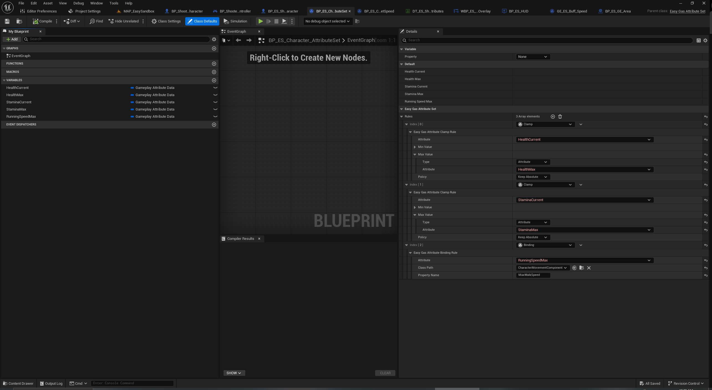

# EasyGas Plugin

## Overview
<b>EasyGas</b> allows to use <b>Gameplay Ability System</b> (GAS) `AttributeSet` created in Blueprint without having to write additional C++ code or restart the editor.

The main goal of creating <b>EasyGas</b> is to unlock the potential of GAS at the Blueprints level.
If the plugin proves to be in demand, We plan to develop it further. I have many ideas for creating tools for developers and game designers that will help speed up prototyping and development at the Blueprints level.

## Table of content
- [How to Install](#How-to-Install)
- [How to Use](#How-to-Use)
- [Settings](#Settings)
- [How it works](#How-it-works)
- [Contact](#Contact)

## How to Install
There are 3 ways to install <b>EasyGas</b>
1. Instal with [Fab](https://www.fab.com/listings/d264d486-869e-4c4c-a5a2-29874d3bc3e1)
2. download the [ZIP archive](https://github.com/YuriyAgapov/EasyGas/archive/refs/tags/release/latest.zip) and unpack into your project's `Plugins` directory.
3. clone the [EasyGas](https://github.com/YuriyAgapov/EasyGas.git) repository into your project's `Plugins` directory and use the release/latest tag.

## How to Use Gameplay Attribute Picker
There is a [video](https://www.youtube.com/watch?v=TmInIqnokQ0) on YouTube with instructions.

To work with GAS attributes, it is now sufficient to create an `AttributeSet` with the necessary attributes (`GameplayAttributeData`) and compile it.

After that, the attributes from it will become available for selection when editing variable values:

When editing the pin value in EventGraph (short format is used, configured in settings):

When editing modifiers in GE (example of implementing the gameplay effect ‘damage over time’):

⚠️Warning: Due to the implementation of GameplayAttribute, it may not be safe to delete an AttributeSet that is used somewhere. I plan to add tools for safely deleting and renaming attributes and AttributeSets in future updates.

<i>Note</i>: <b>EasyGas</b> tries to use different colours for different `AttributeSet`'s to visually separate them

## How to Use with Blueprint

### Attribute Rules

**Attribute Rules** work through the extended `EasyGasAttributeSet`.  
This class allows you to add rule objects to the `Rules` array - they automatically track and handle attribute changes (Pre/Post) without writing any C++ code.  
This section briefly describes the available rules, their purpose, and key fields - aimed at designers working directly in the Blueprint Editor.

---

#### Available Rules

##### Clamp (EasyGasAttributeClampRule)
Clamps the value of an attribute to a defined range. Useful for `Health`, `Energy`, `Stamina`, etc.

**Key Fields**
- **Attribute** - the attribute to clamp.  
- **Min Value / Max Value** - sources for the minimum and maximum values. These can be constants, other attributes, or values calculated dynamically.  
- **Policy** - how to handle the current value when the range changes:
  - **KeepAbsolute** - current value remains unchanged;
  - **KeepRelative** - value is recalculated proportionally to the new range (e.g., if it was 50% of the old range, it stays 50% of the new range);
  - **UseMin** - set value to the new minimum;
  - **UseMax** - set value to the new maximum.

**Usage**
- Triggered during Pre/Post attribute change to ensure the value stays within valid limits.

**Quick Example**
- Clamp `Health` between `0` and `MaxHealth` with `KeepRelative` policy, so health scales proportionally when `MaxHealth` changes.

---

##### Binding (EasyGasAttributeBindingRule)
Synchronizes an attribute value with a numeric property on a component or object. Useful for updating UI, movement parameters, effects, etc.

**Key Fields**
- **Attribute** - the tracked attribute.  
- **ClassPath** - soft reference to the component/object class that contains the property.  
- **PropertyName** - the name of the numeric (float/int) property that will receive the attribute value.

**Notes**
- Value propagation is **one-way**: AttributeSet -> target property.  
- Only numeric properties are supported.  
- `ClassPath` is used at runtime to find a suitable component/object on the AttributeSet owner; the rule caches the target object/property for fast updates.

**Quick Example**
- Bind `Speed` to `MaxWalkSpeed` in a MovementComponent so that fatigue reduces movement speed.

---

##### EasyGasAttributeRule_BP
A flexible rule created in Blueprint. Use this when the standard rules (Clamp or Binding) are insufficient.  
Allows designers to implement custom gameplay logic without C++.

**Events you can override**
- **BP_InitRule(InAttributeSet)** - rule initialization.  
- **BP_InitAttribute(Attribute, MetaData)** - initialization of individual attributes (if subscribed).  
- **BP_OnPreAttributeBaseChange(Attribute, NewValue)** - before base attribute value changes (if subscribed).  
- **BP_OnPreAttributeChange(Attribute, NewValue)** - before final attribute value changes; place clamping/validation logic here.  
- **BP_OnPostAttributeChange(Attribute, OldValue, NewValue)** - after attribute change; place gameplay reactions here (death, triggers, effects, etc.).

**Important Notes**
- Notifications (Init/Pre/Post) are only delivered for attributes explicitly subscribed via `Subscribe(...)`.  
- Attribute values should only be changed from inside handlers (BP_OnPreAttributeChange / BP_OnPostAttributeChange). Calling `SetAttributeValue` outside handlers may cause recursive updates or inconsistent state.

---

#### Adding Rules to EasyGasAttributeSet

1. Open your `EasyGasAttributeSet` in the editor.  
2. In the **Rules** section, click **Add Element**.  
3. Choose the rule type: `Clamp`, `Binding`, or custom.
4. Fill in the fields (Attribute, Min/Max, ClassPath, PropertyName, etc.).  
5. For `EasyGasAttributeRule_BP` - implement the desired events in the Blueprint and **call Subscribe** for the attributes you want notifications for.  

## Settings
The plugin has settings (Project -> Plugins -> EasyGas):
* Use Easy Gas Editor - allows to return to the standard attribute editors without restarting the editor (you will need to reopen or recompile the asset for the editor to update its UI)

| ✔ Enabled |  | Disabled |
| --- | --- | --- |
|  | <-> |  |

* Hide Generated Class Suffix - hides the '_C' suffix for generated classes when displaying attributes

| Enabled |  | ✔ Disabled |
| --- | --- | --- |
|  | <-> |  |

* Hide Class in Pins - hides the AttributeSet name when displayed in EventGraph to make nodes more compact

| Enabled |  | ✔ Disabled |
| --- | --- | --- |
|  | <-> |  |

## How it works
<b>EasyGas</b> operates at the Unreal Engine Editor level, replacing the GAS's attribute editors with its own.

The plugin allows to select attributes from the generated `AttributeSet` and `AbilitySystemComponent` classes.
When changes are made to these classes, <b>EasyGas</b> will attempt to preserve references to their attributes. The exception is when attributes have been renamed or removed from `AttributeSet`.

Note: Even with <b>EasyGas</b> installed, you can always revert to the standard GAS editors without rebooting by disabling the plugin in the settings (Project -> Plugins -> EasyGas). 

⚠️Warning: Please note, the "Hide Generated Class Suffix" setting hides the '_C' suffix only when displayed in <b>EasyGas</b> widgets, this is done solely for convenience. In `DataTable`, you must write the full name of the generated class and the attribute name - 'BP_MyAttributeSet_C.MyAttribute'. For your convenience, in the context menu of <b>EasyGas</b> widgets there is a "Copy Path" item, which allows you to copy the path to the attribute to the clipboard.

## Contact
Email: agapov.yi@gmail.com

Welcome any feedback!