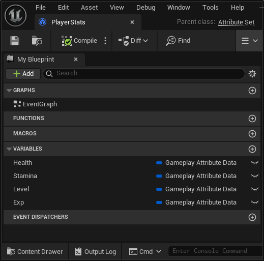
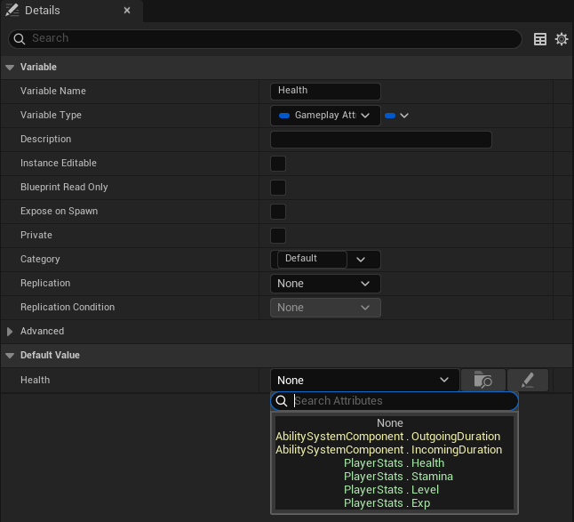
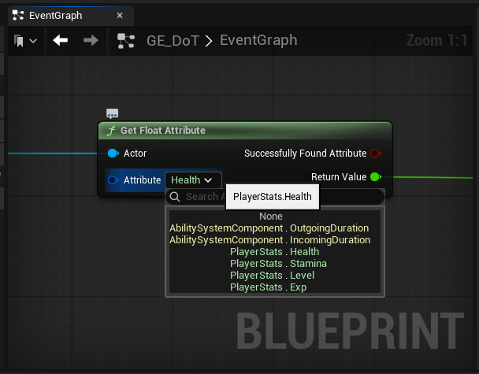
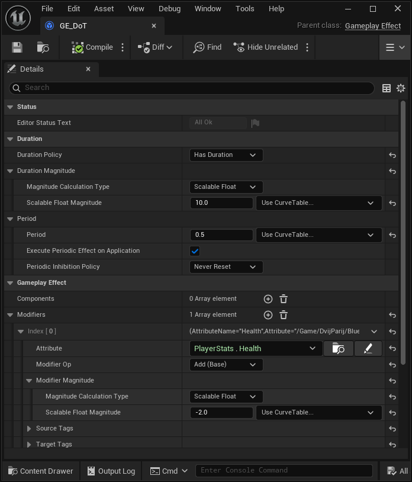

# Overview
<b>EasyGas</b> allows to use <b>Gameplay Ability System</b> (GAS) `AttributeSet` created in Blueprint without having to write additional C++ code or restart the editor.
The plugin works exclusively at the Unreal Engine Editor level and does not add game logic or new data types.

The main goal of creating <b>EasyGas</b> is to unlock the potential of GAS at the Blueprints level without diving into the C++ API.
If the plugin proves to be in demand, We plan to develop it further. I have many ideas for creating tools for developers and game designers that will help speed up prototyping and development at the Blueprints level.

# How to Install
To install <b>EasyGas</b>, clone the [EasyGas](https://github.com/YuriyAgapov/EasyGas.git) repository or download the [ZIP archive](https://github.com/YuriyAgapov/EasyGasPlugin/archive/refs/heads/main.zip) and unpack into your project's `Plugins` directory.

# How to Use
To work with GAS attributes, it is now sufficient to create an `AttributeSet` with the necessary attributes (`GameplayAttributeData`) and compile it.

After that, the attributes from it will become available for selection when editing variable values:

When editing the pin value in EventGraph (short format is used, configured in settings):

When editing modifiers in GE (example of implementing the gameplay effect ‘damage over time’):

<i>Note</i>: <b>EasyGas</b> tries to use different colours for different `AttributeSet`'s to visually separate them

The plugin has settings (Project -> Plugins -> EasyGas):
* Use Easy Gas Editor - allows to return to the standard attribute editors without restarting the editor (you will need to reopen or recompile the asset for the editor to update its UI)
* Hide Generated Class Suffix - hides the '_C' suffix for generated classes when displaying attributes
* Hide Class in Pins - hides the AttributeSet name when displayed in EventGraph to make nodes more compact

# How it works
<b>EasyGas</b> operates at the Unreal Engine Editor level, replacing the GAS's attribute editors with its own.

The plugin allows to select attributes from the generated `AttributeSet` and `AbilitySystemComponent` classes.
When changes are made to these classes, <b>EasyGas</b> will attempt to preserve references to their attributes. The exception is when attributes have been renamed or removed from `AttributeSet`.

Note: Even with <b>EasyGas</b> installed, you can always revert to the standard GAS editors without rebooting by disabling the plugin in the settings (Project -> Plugins -> EasyGas). 

# About Developers
A little bit about us.
My wife and I have been involved in development for quite some time: she for about 10 years, and I for over 20.
We have experience working with various frameworks and languages, and working with Unreal Engine (and GAS) has proven to be particularly exciting for us.

# Contact
Email: easygasplugin@gmail.com
We welcome any feedback!